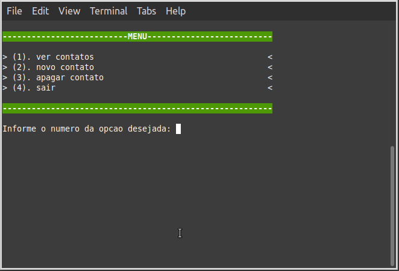
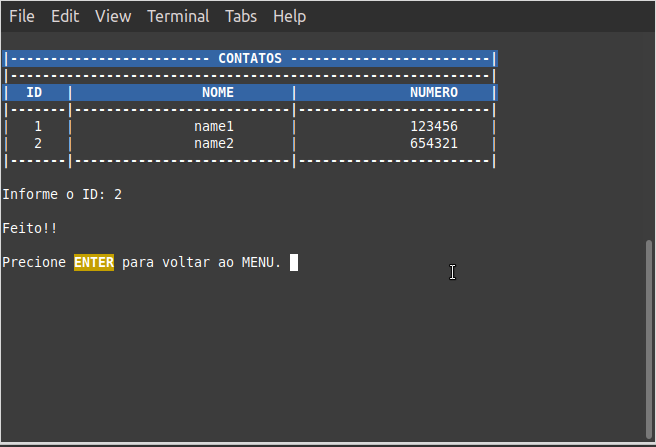

# contact_list (on linux)

I created this simple example of a contact list, to define the main functions for handling C files. 
This example is purely didactic.

# screenshots

## menu

## view

## erase

